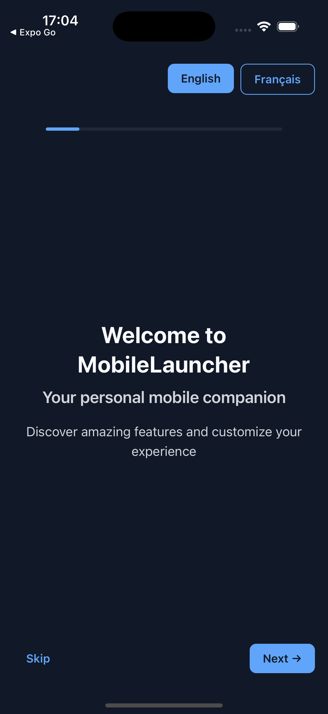
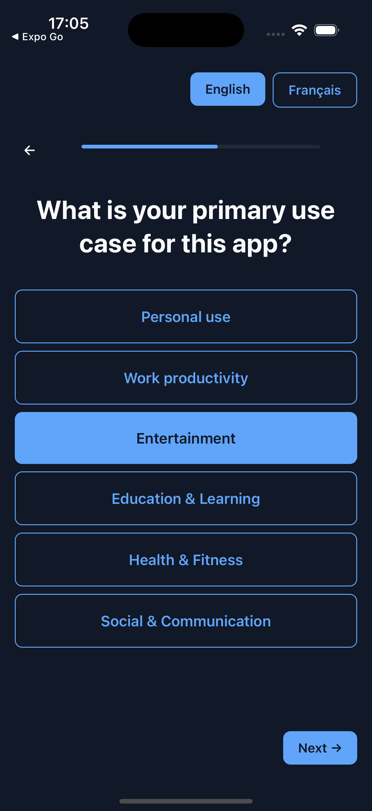
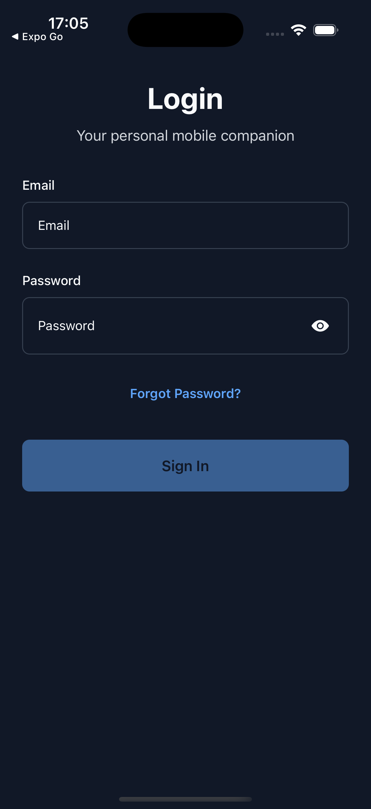
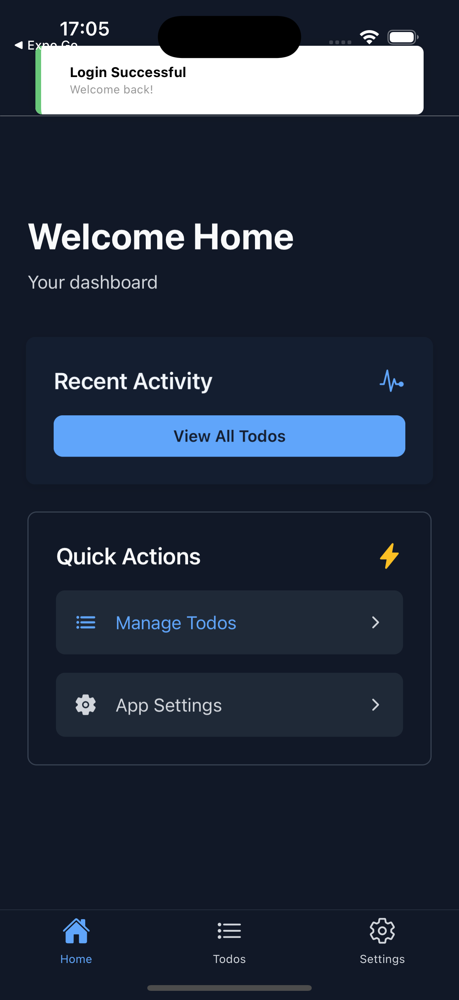
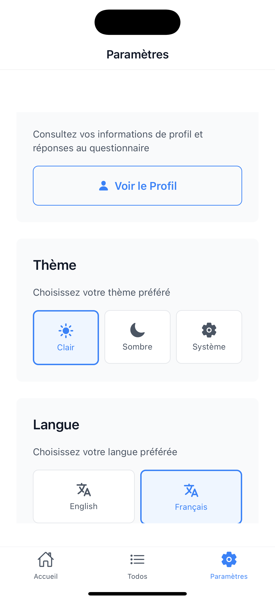
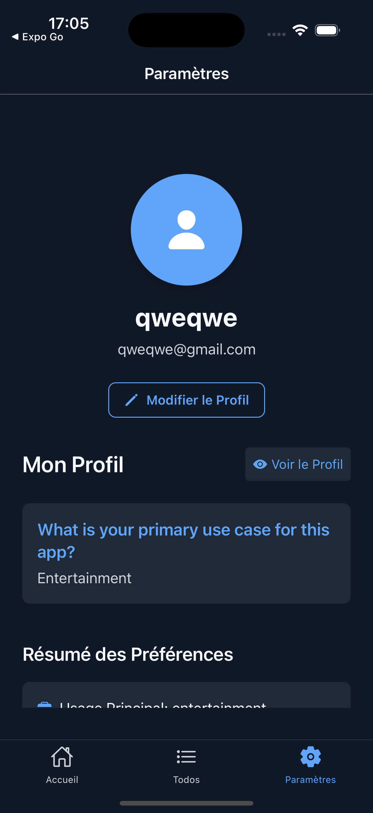
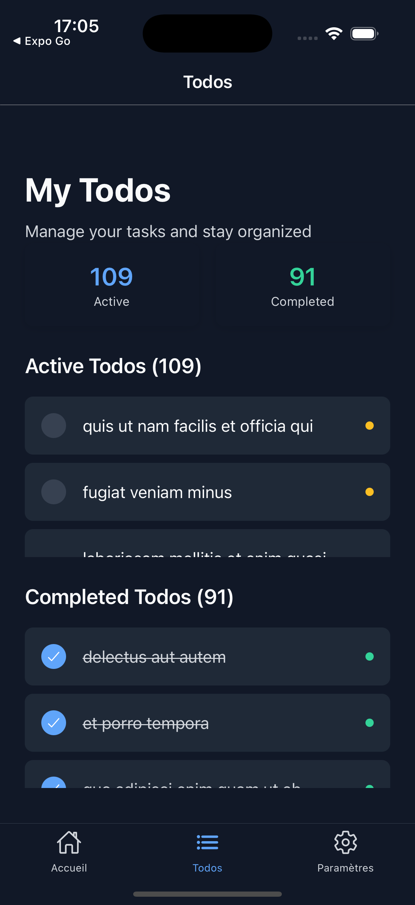

<div align="center">

# AI Mobile Launcher

**The AI-first React Native + Expo boilerplate.**

_Part of [**Wire AI**](https://getwireai.com), the AI-native growth engineer for mobile apps._

Feature-first architecture, TypeScript strict, auth, i18n, theming, Redux Toolkit, and Expo SDK 54 with the New Architecture. Structured so Cursor, Claude Code, and Antigravity generate consistent code without hallucinating your patterns.

[](LICENSE)
[](https://github.com/chohra-med/expo_boilerplate)

Created by [**Malik Chohra**](https://getwireai.com?utm_source=github&utm_medium=readme&utm_campaign=creator) · [Code Meet AI newsletter](https://codemeetai.substack.com?utm_source=github&utm_medium=readme&utm_campaign=newsletter)

Sponsored by [AI Mobile Launcher](https://aimobilelauncher.com?utm_source=github&utm_medium=readme&utm_campaign=sponsor) and [CasaInnov](https://casainnov.com?utm_source=github&utm_medium=readme&utm_campaign=sponsor)

</div>

---

> **Need the complete, production-ready boilerplate?** This is the open Lite starter. The full **AI Mobile Launcher** (auth, payments, AI features, and the rest) is at **[aimobilelauncher.com](https://aimobilelauncher.com?utm_source=github&utm_medium=readme&utm_campaign=complete)**.

## Why this boilerplate?

Most React Native starters give you a blank canvas. That's fine for a side project — it's a liability on production work or when you're using AI coding tools.

After 7 years of shipping React Native apps — enterprise clients, health tech, coaching platforms — I kept rebuilding the same foundation from scratch. Authentication, onboarding, theming, i18n, state management, folder structure, TypeScript config. Every time.

This is that foundation, extracted and open-sourced.

Three reasons to use it over `npx create-expo-app`:

1. **Production-grade from day one.** Auth flow, onboarding, secure storage, RTK Query, MMKV, Reanimated, FlashList — already wired together and tested.
2. **Feature-first architecture that scales.** Code organized by business feature, not technical layer. Onboard new engineers in a day. Delete features without touching unrelated code.
3. **AI-native by design.** Includes `CLAUDE.md` and `AGENTS.md` so Claude Code, Cursor, and Antigravity understand your architecture from session one. No re-priming. No hallucinated patterns.

---

## 🚀 Features

- **Feature-First Architecture** — organized by business features, not technical layers
- **Authentication** — complete login system with secure token storage
- **AI activation by default**: Wire AI finds what makes your users stay, and once a key is configured the onboarding screen renders Wire AI's backend-driven onboarding flow, with the built-in static questionnaire as an automatic fallback (setup steps under "Get your Wire AI keys")
- **Internationalization** — English and French language support
- **Theming** — Light/Dark/System theme support with Restyle
- **State Management** — Redux Toolkit with RTK Query
- **Navigation** — React Navigation with type-safe routing
- **UI Components** — reusable components built with Restyle
- **TypeScript** — strict configuration, no implicit any
- **Secure Storage** — encrypted storage for sensitive data
- **Performance** — MMKV, FlashList, and optimized animations
- **Error Handling** — global error boundary with recovery
- **Analytics + Crashlytics** — real Firebase Analytics with a typed event registry, plus Crashlytics crash reporting through a unified logger
- **Payments** — RevenueCat service + a ready-made, configurable paywall feature
- **AI Context Files** — `CLAUDE.md` and `AGENTS.md` for AI coding tools

---

## 📱 Screenshots

<div align="center">
  <h3>App Flow Overview</h3>
  <p>Experience the complete user journey from onboarding to main features</p>
</div>

### Welcome & Onboarding
<div align="center">
  
  
  
  
</div>

### Authentication & Main Features
<div align="center">
  
  
  
</div>

---

## 📁 Project Structure

```
src/
├── features/                    # Feature-specific code
│   ├── auth/                   # Authentication feature
│   │   ├── api/               # API calls and endpoints
│   │   ├── components/        # Feature-specific components
│   │   ├── hooks/            # Custom hooks
│   │   ├── screens/          # Screen components
│   │   ├── services/         # Business logic
│   │   ├── store/            # State management
│   │   └── types/            # Type definitions
│   ├── onboarding/           # Onboarding flow
│   ├── home/                 # Home screen
│   ├── settings/             # Settings screen
│   └── todos/                # Todos feature
├── navigation/                 # Navigation configuration
│   ├── navigators/           # Navigator components
│   ├── routes.ts             # Route definitions
│   └── routes.types.ts       # Navigation types
├── services/                  # Global services
│   ├── api/                  # API configuration
│   ├── storage/              # Storage services
│   ├── analytics/            # Analytics service
│   └── logging/              # Logging services
├── store/                     # Global store configuration
│   ├── store.ts              # Store setup
│   ├── reducers.ts           # Root reducer
│   └── app.slice.ts          # App-level state
├── ui/                        # Shared UI components
│   ├── components/           # Reusable components
│   ├── style/                # Theme and styling
│   └── tokens/               # Design tokens
├── utils/                     # Utility functions
├── schemas/                   # Data validation schemas
├── config/                    # Configuration files
├── entrypoints/              # App entry points
├── providers/                # App providers
└── locales/                  # Translation files
```

---

## 🛠️ Tech Stack

- **React Native** with Expo SDK 55 + New Architecture
- **TypeScript** — strict mode, no implicit any
- **Redux Toolkit** — state management
- **RTK Query** — data fetching and caching
- **React Navigation** — type-safe navigation
- **Restyle** — styling and theming system
- **React Hook Form** + Zod — form validation
- **i18next** — internationalization
- **Expo Secure Store** — encrypted storage
- **MMKV** — high-performance local storage
- **Redux Persist** — state persistence
- **Biome** — linting and formatting
- **React Native Reanimated** — animations
- **FlashList** — optimized lists

---

## 🤖 AI Coding Tool Setup

This boilerplate ships with a layered AI rules system. Every tool — Claude Code, Cursor, Antigravity, or any agent — reads from the same source of truth and generates architecture-consistent code from session one.

### What's tracked in git (shipped with the boilerplate)

| File | Tool | Purpose |
|---|---|---|
| [`CLAUDE.md`](CLAUDE.md) | Claude Code | Loaded automatically at session start. Routes to rule files, surfaces the project skill. |
| [`AGENTS.md`](AGENTS.md) | Cursor, Antigravity, all agents | Cross-tool context: architecture, banned patterns, what to generate and what not to. |
| [`CLAUDE_SKILL.md`](CLAUDE_SKILL.md) | Claude Code | Documents the `/mobilelauncher` skill and all available commands. |
| [`boilerplate_content.md`](boilerplate_content.md) | Reference | Full architecture reference: every package, every pattern, every rule in one file. |
| [`.claude/skills/mobilelauncher/`](.claude/skills/mobilelauncher/skill.md) | Claude Code | Executable skill — generates features, screens, components, hooks, slices, endpoints, and schemas that match this codebase exactly. |


### The Claude Code skill

Once you clone the repo, run `/mobilelauncher orient` to get a full project briefing. Then use the skill to scaffold new code:

```
/mobilelauncher feature notifications    → full feature scaffold (8 files)
/mobilelauncher screen home dashboard    → typed, memoized screen
/mobilelauncher component avatar         → Restyle UI component
/mobilelauncher hook use-pagination      → custom hook
/mobilelauncher schema invoice           → Zod schema
```

Every generated file follows the repo's conventions — feature-first, Restyle-only, typed selectors, FlashList, i18next — with a post-generation checklist of what to register (reducer, route, translations, tests).

### Why this approach works

Without these files, AI tools guess your patterns and produce code you have to rewrite. With them:

- Cursor reads `.cursor/rules/` before writing any code
- Claude Code reads `CLAUDE.md`, then the skill generates compliant files
- Any new agent reads `AGENTS.md` and knows exactly what to produce and what to never generate
- The memory bank in `ai_articles/memory-bank/` gives AI tools architectural context that doesn't fit in rules

One set of rules. Every tool, every session, every engineer.

---

## 🚀 Getting Started

### Prerequisites

- Node.js (v16 or higher)
- Yarn package manager
- Expo CLI
- iOS Simulator or Android Emulator

### Installation

1. Clone the repository:
```bash
git clone https://github.com/chohra-med/expo_boilerplate.git
cd expo_boilerplate
```

2. Install dependencies:
```bash
yarn install
```

3. Start the development server:
```bash
yarn start
```

4. Run on your preferred platform:
```bash
# iOS
yarn ios

# Android
yarn android

# Web
yarn web
```

---

## 🏗️ Architecture Overview

### Feature-First Structure

Each feature is self-contained with its own:
- **Components** — feature-specific UI components
- **Screens** — screen components
- **Hooks** — custom hooks for business logic
- **Store** — Redux slice and selectors
- **API** — RTK Query endpoints
- **Services** — business logic services
- **Types** — TypeScript type definitions

No cross-feature imports. Each feature can be deleted or moved without breaking others.

### State Management

- **Redux Toolkit** — modern Redux with less boilerplate
- **RTK Query** — data fetching and caching
- **Redux Persist** — automatic state persistence with MMKV
- **Type-safe selectors** — using createSelector

### Theming System

- **Restyle** — type-safe styling system
- **Light/Dark themes** — automatic theme switching
- **System theme** — follows device preference
- **Design tokens** — consistent spacing, colors, and typography

### Navigation

- **Type-safe navigation** — full TypeScript support
- **Nested navigators** — Stack → Tab navigation
- **Authentication guards** — automatic route protection
- **Deep linking** — URL-based navigation support

---

## 🔧 Configuration

### Environment Variables

Create a `.env` file in the root directory:

```env
API_BASE_URL=https://your-api-url.com
```

### Path Mapping

The project uses path mapping for clean imports:

```typescript
// Instead of
import { Button } from '../../../ui/components/button';

// Use
import { Button } from '#ui/components/button';
```

### Adding New Features

1. Create feature directory:
```bash
mkdir -p src/features/new-feature/{api,components,hooks,screens,services,store,types}
```

2. Follow the established patterns:
   - Create types in `types/index.ts`
   - Add Redux slice in `store/`
   - Create components in `components/`
   - Add screens in `screens/`
   - Implement hooks in `hooks/`

---

## 🤖 AI activation by default

[Wire AI](https://getwireai.com) finds what makes your users stay, and this boilerplate
ships ready for it. The `OnboardingFlow` screen renders Wire AI's backend-driven
onboarding flow when a key is configured, and falls back to the built-in static
questionnaire otherwise, the exact same flow this boilerplate has always shipped.

- **No key set (fresh clone):** `isOnboardingEnabled()` is `false`, so the static
  questionnaire renders unchanged. Zero setup.
- **Key set:** the screen renders `<WireOnboarding>` with your static flow passed
  as `fallbackFlow`, so if the flow cannot be fetched or the backend fails it degrades
  to the static flow instead of breaking onboarding. Session persistence uses a small
  MMKV adapter.

### Get your Wire AI keys

Onboarding runs the app's built-in static questionnaire until you add a Wire AI key,
so a fresh clone works with zero setup. Adding a key upgrades that same screen to
Wire AI's backend-driven onboarding flow.

1. **Create your account** at [getwireai.com/signup](https://getwireai.com/signup). You
   give it an app name and your email.
2. **Confirm the email** and set your password. That is your console login.
3. **Open the [console](https://getwireai.com/console).** Your app is already there, created
   from the name you gave at signup. Add another app any time you need a second key.
4. **Copy the app's API key (`wai_…`) and its app id.** The key lives in the console, so you
   can read it back later, and you do not have to save it now.
5. **Paste them into `.env`** (copy `.env.example` first):

   ```bash
   EXPO_PUBLIC_WIREAI_API_KEY=wai_your_key_here
   EXPO_PUBLIC_WIREAI_SERVER_URL=https://wire-rn-dynamic-onboarding.fly.dev
   EXPO_PUBLIC_WIREAI_APP_ID=your-app-id
   ```

6. **Restart Metro with the cache cleared** (`yarn start -c`). `EXPO_PUBLIC_*` values are
   inlined at build time, so a running bundler will not pick them up.

**What you get on day one:** a new app starts on the free plan running a short scripted
starter flow. Real onboarding, recorded in your funnel, but no model calls yet. Turning on
the AI-generated flow is a manual step today: ask for it by email and it gets switched on for
your app. The analytics, the funnel and the static flow all work immediately.

Set these in `.env` to turn it on. See the day-one note above for what runs before the AI
flow is switched on.

```env
EXPO_PUBLIC_WIREAI_API_KEY=wai_your_key_here
EXPO_PUBLIC_WIREAI_SERVER_URL=https://wire-rn-dynamic-onboarding.fly.dev
EXPO_PUBLIC_WIREAI_APP_ID=your-app-id
```

Wiring lives in `src/features/onboarding/screens/wire-onboarding-screen.tsx`
(the gate + fallback) and `src/features/onboarding/services/wire-onboarding-storage.ts`
(the MMKV session adapter).

---

## 🧭 Guided tours & feature showcase

Two more onboarding surfaces ship wired, both from the same kit
(`@wireai/activation`, subpath imports so the core stays dependency-free):

- a **feature showcase** — a few static intro slides shown once before onboarding, and
- **coachmarks** — a performance-first guided tour that rings real UI elements on the
  home screen after the user lands.

The kit owns the animation, blur spotlight, ring, gesture hand, measuring, and
one-overlay queue; the app only declares **where** things anchor and **which** tour
plays.

### Provider (mounted once)

`<CoachmarkProvider>` wraps the `NavigationContainer` in
`src/entrypoints/app.tsx`, so its overlay host is a root-level sibling and a ring
can paint **above** the bottom tab bar. It takes a **synchronous** storage adapter
(`src/services/storage/coachmark-storage.ts`, a 2-method MMKV wrapper) so a "seen"
gate resolves during render with no ring flash:

```tsx
<CoachmarkProvider
  storage={coachmarkStorage}
  accentColor={theme.colors.primary}
  isTestingCoachmark={IS_TESTING_COACHMARK}
>
  <NavigationContainer>{/* … */}</NavigationContainer>
</CoachmarkProvider>
```

### The feature map (one place to declare tours)

`src/config/coachmarks.ts` is the app's **feature map** — an array of
`{ id, anchorId, screen, message, gesture }` entries. Each `id` is the anchor
lookup key, the analytics name, and (later) the token the AI selects on. The tour
is built through `selectTourSteps(catalog)`, which is the drop-in seam for the
AI-selection phase: when the Wire backend starts emitting an ordered
`coachmarks: string[]` chosen from a user's captured intent, you pass it straight
through — `buildHomeTourSteps(plan.coachmarks)` — and nothing else changes.

### Anchors + the tour

On `src/features/home/screens/home-screen.tsx`, the two most prominent interactive
elements — the primary **"View All Todos"** button and the **Settings** row — are
made ringable with `useCoachmarkAnchor(id)` (attach the ref to a plain `View` with
`collapsable={false}` so the native node survives measurement). The first-run tour
plays via `useCoachmarkTour(steps, { tourId: "boilerplate_home_tour", enabled, … })`.

Gating lives **in the kit**: it reads/writes `wire_coachmark_<tourId>_seen` through
the injected storage, so a tour never nags twice and the app keeps no bookkeeping.
Analytics stay callback-based (`onStepShown` / `onStepEngaged` / `onStepDismissed`)
so there's no analytics dependency inside the kit — here they route to the app's
own `analytics.track(...)`.

### App-intro showcase

`src/features/onboarding/config/app-showcase.ts` declares a `ShowcaseConfig` (3
slides reusing the bundled brand assets). `src/features/onboarding/screens/wire-onboarding-screen.tsx`
renders `<FeatureShowcase>` **before** the Wire onboarding entry; the kit gates it
once through the same storage (`wire_showcase_<id>_seen`) and, if already seen,
renders nothing and calls `onDone` from an effect.

### QA replay — `isTestingCoachmark`

Flip `IS_TESTING_COACHMARK` to `true` in `src/config/coachmarks.ts` (or gate it on
`__DEV__`). While it's on, every "seen" gate reads as unseen **and** every write is
suppressed, so every tour **and** the showcase replay on each launch — one boolean
re-sees the whole surface. Ship it `false`.

> Optional peers pulled in by these subpaths: `react-native-reanimated` +
> `expo-blur` (coachmarks) and `@blazejkustra/react-native-onboarding` (showcase).
> All are declared in `package.json`.

---

## 📊 Analytics & Crashlytics

Real **Firebase Analytics** and **Crashlytics**, behind one typed facade — no
Sentry, Crashlytics is the only crash channel.

- Import from `#root/analytics`: `analytics.track(EVENTS.FEATURE_USED, { ... })`.
- `EVENTS` is a frozen, validated event registry; app-specific enum values live in
  `src/analytics/events.app.ts`. Params are sanitized (Firebase limits + a PII
  denylist) before they reach the transport.
- Screen views + funnel drop-off: `useScreenTracking` (wired in `app.tsx`) and
  `useFunnel`.
- Everything routes through the unified logger (`#root/services/logging`), which
  fans out to console (dev), Firebase Analytics, and Crashlytics transports.
- Collection is OFF in `__DEV__` and ON in release, automatically.

Analytics is initialized at boot in `src/entrypoints/hooks/use-app-initializer.ts`.

**Native config (buyer-supplied, not committed):** add your own
`android/app/google-services.json` and `ios/GoogleService-Info.plist` from the
Firebase console, then run a native prebuild / EAS build. The required Expo config
plugins (`@react-native-firebase/app`, `@react-native-firebase/crashlytics`,
`expo-build-properties` with iOS static frameworks) are already declared in
`app.json`. In Expo Go / dev, a silent mock is used so the app runs without any
Firebase config.

---

## 💳 Payments (RevenueCat)

A RevenueCat service (`#root/services/revenuecat`) plus a ready-made paywall
feature (`src/features/paywall/`) — screen, presentational view, package cards,
config, and a skip-cooldown slice.

- Add your keys and (optionally) the entitlement id:

```env
EXPO_PUBLIC_REVENUECAT_IOS_API_KEY=appl_your_ios_key
EXPO_PUBLIC_REVENUECAT_ANDROID_API_KEY=goog_your_android_key
EXPO_PUBLIC_REVENUECAT_ENTITLEMENT_ID=premium   # defaults to "premium"
```

- The entitlement id is **parameterized** — point it at whatever entitlement you
  configured in the RevenueCat dashboard; no code changes.
- Without a key, init is skipped and the paywall degrades gracefully.
- **Release-build guard:** a `test_` key in a release build is rejected on purpose
  (it would otherwise crash the native SDK). Use production `goog_`/`appl_` keys
  for release.

RevenueCat is initialized at boot alongside analytics. `react-native-purchases`
autolinks — no extra Expo config plugin needed.

---

## 🌐 Internationalization

### Adding New Languages

1. Create translation file in `src/locales/`:
```json
{
  "common": {
    "loading": "Loading...",
    "error": "An error occurred"
  }
}
```

2. Update `src/config/i18n.ts` to include the new language

### Using Translations

```typescript
import { useTranslation } from 'react-i18next';

const MyComponent = () => {
  const { t } = useTranslation();
  return <Text>{t('common.loading')}</Text>;
};
```

---

## 🎨 Theming

### Adding New Colors

1. Update `src/ui/tokens/colors.ts`:
```typescript
const palette = {
  brand: '#FF6B6B',
};
```

2. Use in components:
```typescript
<Box backgroundColor="brand" />
```

### Creating New Components

```typescript
import { createBox } from '@shopify/restyle';
import { Theme } from '#ui/style/theme';

const StyledComponent = createBox<Theme>();

export const MyComponent = ({ ...props }) => {
  return <StyledComponent {...props} />;
};
```

---

## 🔐 Authentication

Secure token storage, automatic token refresh, login/logout, protected routes, and user profile management — all pre-wired.

```typescript
import { useAuth } from '#features/auth';

const MyComponent = () => {
  const { user, isAuthenticated, login, logout } = useAuth();
};
```

---

## 📱 Navigation

### Adding New Routes

1. Update `src/navigation/routes.ts`:
```typescript
export const routes = {
  NewFeature: {
    name: 'NewFeature',
    args: noArgs,
  } as const,
};
```

2. Update navigation types in `src/navigation/routes.types.ts`

---

## 🗄️ Storage

### Secure Storage

```typescript
import { secureStorage } from '#services/storage/secure-storage';

await secureStorage.setItem('auth_token', token);
const token = await secureStorage.getItem('auth_token');
```

### MMKV Storage

```typescript
import { mmkv } from '#services/storage/mmkv-storage';

mmkv.set('user_preferences', JSON.stringify(preferences));
const preferences = mmkv.getString('user_preferences');
```

---

## 🎭 Animations

```typescript
import Animated, { useSharedValue, withSpring } from 'react-native-reanimated';

const MyComponent = () => {
  const scale = useSharedValue(1);

  const handlePress = () => {
    scale.value = withSpring(1.2);
  };

  return (
    <Animated.View style={{ transform: [{ scale }] }}>
      {/* content */}
    </Animated.View>
  );
};
```

---

## 📊 Performance

### FlashList

```typescript
import { FlashList } from '@shopify/flash-list';

const MyList = () => (
  <FlashList
    data={data}
    renderItem={renderItem}
    estimatedItemSize={100}
  />
);
```

### Performance Monitoring

```typescript
import { logger } from '#services/logging';

logger.logEvent('screen_load_time', {
  screen: 'HomeScreen',
  loadTime: 150,
});
```

---

## 🧪 Development

### Testing

```bash
yarn test
yarn test:watch
yarn test:coverage
```

- **Unit Tests** — custom hooks, Redux slices, utility functions
- **Component Tests** — React Native Testing Library
- **API Tests** — RTK Query endpoint testing
- **Coverage** — 70%+ required

### Linting and Formatting

```bash
yarn lint
yarn lint:fix
yarn format
yarn format:fix
```

---

## 📦 Available Scripts

| Script | Description |
|---|---|
| `yarn start` | Start Expo dev server |
| `yarn ios` | Run on iOS simulator |
| `yarn android` | Run on Android emulator |
| `yarn web` | Run in browser |
| `yarn test` | Run all tests |
| `yarn test:watch` | Run tests in watch mode |
| `yarn test:coverage` | Run tests with coverage |
| `yarn lint` | Check linting issues |
| `yarn lint:fix` | Fix linting issues |
| `yarn format` | Format code |
| `yarn format:fix` | Fix formatting issues |

---

## 🤝 Contributing

1. Fork the repository
2. Create your feature branch (`git checkout -b feature/your-feature`)
3. Commit your changes (`git commit -m 'Add your feature'`)
4. Push to the branch (`git push origin feature/your-feature`)
5. Open a Pull Request

---

## Built with Spec Harness

This repo ships with the **Spec Harness** dev workflow baked in (`.claude/` agents and commands, `constitution.md`, and a persistent `.memory/` bank). Every feature runs the same loop: spec, plan, tasks, build, VERIFY, learn.

Lessons get captured into a memory bank that survives across sessions, so contributions stay specced, verified, and consistent. See `SPEC-HARNESS.md` for the integrate guide.

---

## The Wire AI ecosystem

[Wire AI](https://getwireai.com) is the AI-native growth engineer for mobile apps: one agent that runs four versions of every step of your users' journey, live at once, and keeps what makes them stay. This starter is one piece of that ecosystem:

- **Wire RN SDK** (`wireai-rn`): the open-source React Native SDK that renders Wire's AI-driven flows as native components in your app. https://github.com/chohra-med/wireai-rn
- **Expo boilerplate** (you are here): an open-source Expo starter wired for Wire AI activation out of the box.
- **Claude skills**: skills for each part of the app (SDK integration, the question script, the learning loop) that explain and drive the work from inside your editor.
- **Hosted MCP server**: connect Claude, Cursor, or any MCP client to Wire's hosted server at `https://wireai-mcp.fly.dev/mcp` with an `Authorization: Bearer <key>` header to read your funnel and run the improve loop. Nothing runs from your repo.

The activation kit ships as [`@wireai/activation`](https://www.npmjs.com/package/@wireai/activation) on npm.

---

## 📄 License

MIT — see the [LICENSE](LICENSE) file for details.

---

## 📞 Support

- [Open an issue](https://github.com/chohra-med/expo_boilerplate/issues)
- Follow the build in public on [LinkedIn](https://www.linkedin.com/in/malik-chohra/)
- Weekly signal in [Code Meet AI newsletter](https://codemeetai.substack.com/?utm_source=github&utm_medium=readme&utm_campaign=expo_boilerplate&utm_content=support_newsletter)

---

## 🙏 Acknowledgments

- [Expo](https://expo.dev/) — development platform
- [React Navigation](https://reactnavigation.org/) — navigation
- [Redux Toolkit](https://redux-toolkit.js.org/) — state management
- [Restyle](https://github.com/Shopify/restyle) — styling
- [React Native Reanimated](https://docs.swmansion.com/react-native-reanimated/) — animations

---

**Built by [Malik Chohra](https://www.linkedin.com/in/malik-chohra/) — AI-first mobile engineer, founder of [CasaInnov](https://casainnov.com/?utm_source=github&utm_medium=readme&utm_campaign=expo_boilerplate&utm_content=footer_casainnov) and [AI Mobile Launcher](https://www.aimobilelauncher.com/?utm_source=github&utm_medium=readme&utm_campaign=expo_boilerplate&utm_content=footer_aiml).**

---

## More from Code Meet AI

**Open source:** [wireai-rn](https://github.com/chohra-med/wireai-rn) · [colorway-c-brand](https://github.com/chohra-med/colorway-c-brand) · [claude_design_skill](https://github.com/chohra-med/claude_design_skill)
**Products:** [AI Mobile Launcher](https://aimobilelauncher.com) · [AI Web Launcher](https://aiweblauncher.com) · [Wire AI](https://getwireai.com) · [CasaInnov](https://casainnov.com)
**Follow:** [Newsletter](https://codemeetai.substack.com) · [YouTube](https://youtube.com/@codemeetai)
